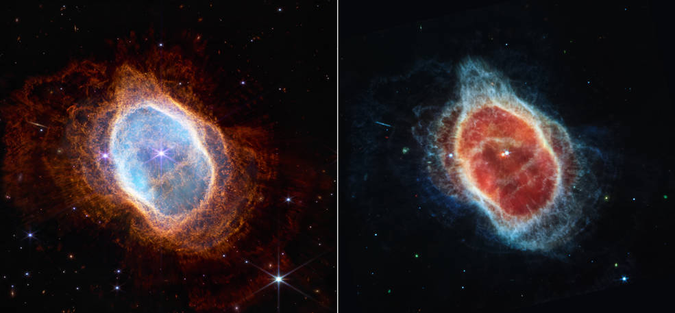
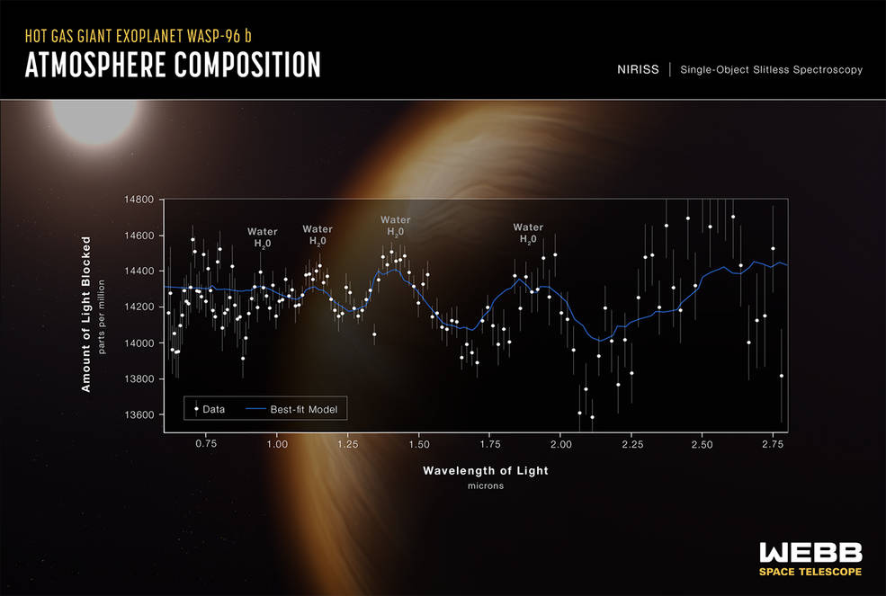

## JWST Images

Image Sources:

https://stsci-opo.org

## Stephan's Quintet (NIRCam and MIRI Composite Image)

[Stephan's Quintet (High Resolution)](./STScI-01G7DB1FHPMJCCY59CQGZC1YJQ/large-0.png)

[Stephan's Quintet (High Resolution)](./STScI-01G7DB1FHPMJCCY59CQGZC1YJQ/large-1.png)

## Southern Ring Nebula (NIRCam and MIRI Images Side by Side):

[Southern Ring Nebula (High Resolution)](./STScI-01G79R28V7S4AXDN8NG5QCPGE3/large.png)

## “Cosmic Cliffs” in the Carina Nebula (NIRCam Image):

[“Cosmic Cliffs” (High Resolution)](./STScI-01G7ETPF7DVBJAC42JR5N6EQRH/large-0.png)

[“Cosmic Cliffs” (High Resolution)](./STScI-01G7ETPF7DVBJAC42JR5N6EQRH/large-1.png)

## Webb's First Deep Field (NIRCam Image):

[Webb's First Deep Field (High Resolution)](./STScI-01G7DDBW5NNXTJV8PGHB0465QP/large.png)

## Exoplanet WASP-96 b (NIRISS Transmission Spectrum):

[Exoplanet WASP-96 b (High Resolution)](./STScI-01G7NBXDHYYSVBP2M476PRGG3A/large.png)

Additional Information
